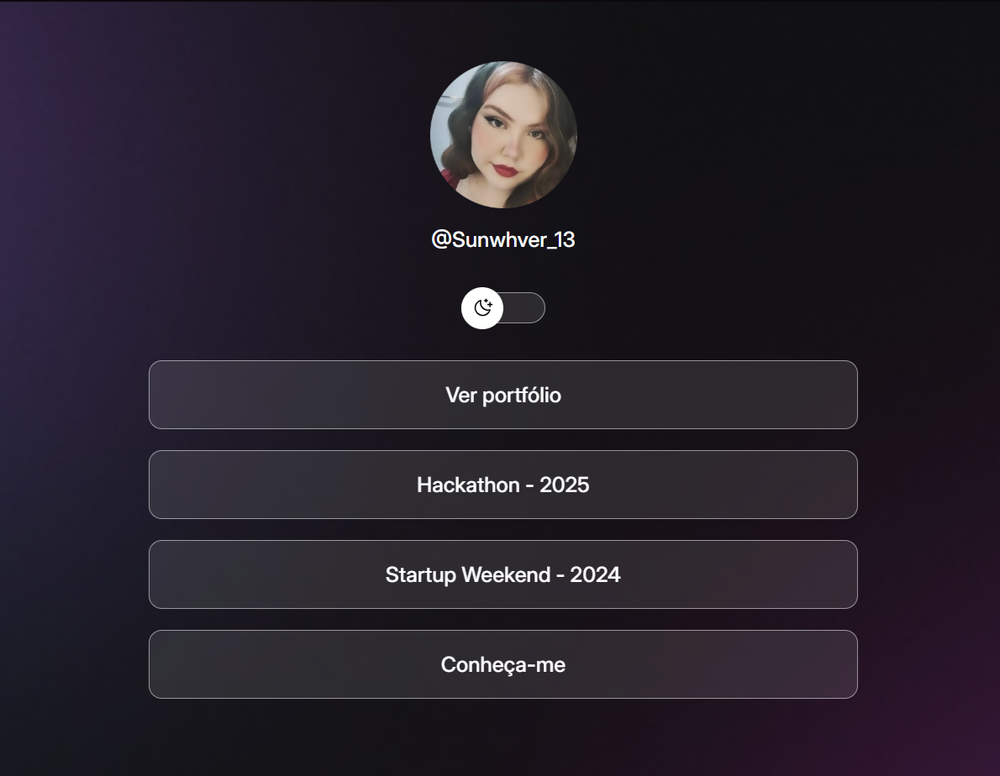
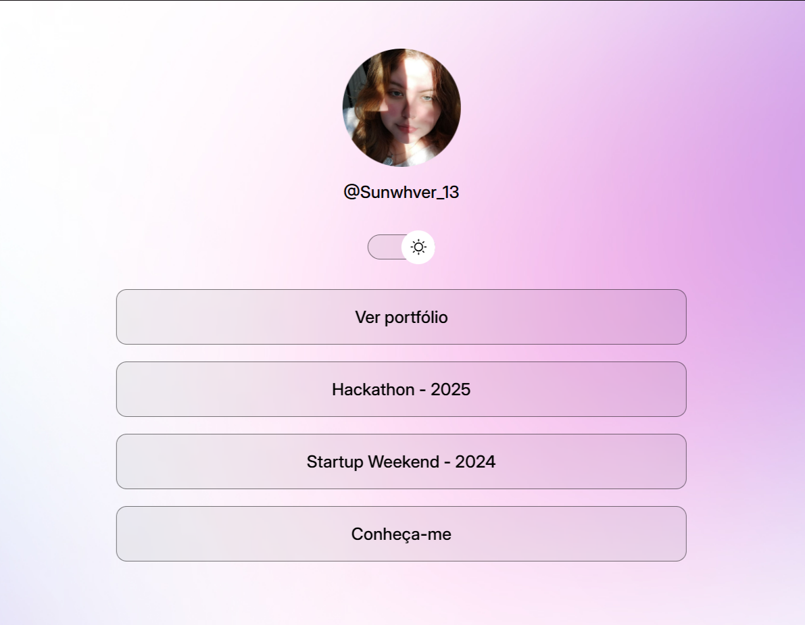

<h1 align="center">Projeto - Desenvolvimento</h1>

## Sobre o trabalho
#### Esse é um trabalho referente a um curso da Rocketseat proposto pelo professor Líbório Júnior em sala. Este trabalho vale nota no primeiro bimestre do quarto semestre do curso de Sistemas de Informação da Universidade MaterDei - UniMater.

#### O objetivo do curso da RocketSeat é aprender a programar do zero em HTML e CSS, com a criação de um site que serve para agrupar links de forma simples e funcional, utilizando também JavaScript para implementar interatividade e recursos dinâmicos.

             
 

<h3 style="font-weight: 700"> Primeiro commit</h3>

<!-- descrição do primeiro commit -->
##### No primeiro commit do projeto, criei o repositório no GitHub chamado projeto_curso e, em seguida, configurei a estrutura inicial do projeto no meu computador. Criei uma pasta chamada projeto no diretório do meu usuário e dentro dela os arquivos principais: index.html, style.css e settings.json. Conectei o arquivo CSS ao HTML para garantir a estilização da página.

##### Baixei a pasta de imagens, chamada "assets", da aba de materiais adicionais do curso, e fiz algumas modificações. Excluí as duas fotos de avatar padrão e substituí por duas fotos minhas. Para isso, busquei as imagens no Google Fotos, enviei para o meu Google Drive, baixei-as no notebook e as editei utilizando o site Fotor para recortar as imagens no formato redondo, semelhante ao perfil de redes sociais. Após a edição, salvei as imagens em formato PNG e as adicionei na pasta "assets" do projeto.

##### Além disso, no arquivo style.css, apliquei uma das imagens como fundo do site, personalizando ainda mais a aparência da página. Esse commit marca o início da organização e personalização visual do projeto.
 

<h3 style="font-weight: 700"> Segundo commit</h3>

##### Neste commit, foi criada a lista de links com redes sociais e documentos de apoio no Notion, visando um maior detalhamento do projeto. Para isso, busquei as logos dos aplicativos/sites que estou utilizando até o momento, como Notion, Figma e o Google Drive, utilizado para exportação de imagens. Inicialmente, as logos seriam armazenadas na pasta "assets" do projeto, porém, devido à dificuldade em encontrar boas imagens, optei por utilizar ícones do site Icons8.

##### Fiz também algumas alterações na imagem de avatar que havia adicionado no primeiro commit. A imagem foi mantida centralizada e, abaixo dela, acrescentei o meu @ do Instagram. Também estilizei a lista de links, que já está devidamente configurada com os links necessários para esta página. Cada botão da lista está funcional e linkado conforme necessário.
 

<h3 style="font-weight: 700"> Terceiro commit</h3>

##### A revisão do código para o terceiro commit incluiu a implementação de ícones para as redes sociais, que agora estão devidamente linkados. Além disso, fiz ajustes na lista de links, removendo alguns itens, e também criei o rodapé da página. Suavizei os estilos de alguns elementos, adicionei um efeito hover nos botões das redes sociais e fiz pequenas mudanças para personalizar o layout de acordo com meu gosto.

##### Acredito que a estrutura da página, no modo padrão da página, modo esturo, está pronta. Agora, o próximo passo será definir algumas seções e conteúdos adicionais que desejo incluir, como os projetos nos quais participei e links futuros. O curso está em andamento, e vejo que a página está tomando uma boa forma para a sua finalização.
 

<h3 style="font-weight: 700"> Quarto commit</h3>

##### Este commit foi feito para ajustar a indentação do código e adicionar comentários no arquivo style.css. Também realizei algumas modificações nas configurações do arquivo settings.json do projeto, visando uma melhor organização e facilitar minha navegação no código. Essas mudanças foram feitas para garantir uma estrutura mais clara antes de iniciar a segunda parte do curso, que envolve a implementação do modo claro da página.
 

<h3 style="font-weight: 700">Quinto commit</h3>

##### Este commit marca o início da implementação do modo claro (light mode) no site. Foram realizados pequenos ajustes no CSS, incluindo alterações de URLs, imagens e a adição de um botão de alternância (switch) entre os modos claro e escuro.

##### O botão já altera ícone e posição de acordo com a classe definida no <html> (light ou dark), mas ainda não está funcional. Além disso, foram feitas modificações sutis, como a conversão de cores, gradientes e outros estilos em variáveis CSS, permitindo que sejam aplicadas de forma diferente quando a classe light estiver ativa.

##### O botão de switch está visualmente pronto; o próximo passo será implementar sua funcionalidade.
 

<h3 style="font-weight: 700">Sexto commit</h3>

##### Este commit consiste em alterações simples com o objetivo de deixar a página mais organizada para futuras implementações. As mudanças realizadas incluem:

- Atualização dos links para redirecionar para páginas individuais de projetos no meu Notion.

- Adição de novos itens à lista de links.

- Melhorias no rodapé para maior clareza e funcionalidade.

- Verificação e ajustes na indentação do código para manter uma estrutura mais limpa e consistente.

##### Essas alterações são um preparativo antes de iniciar a parte de JavaScript da página. Indo para a reta final do projeto. Alterações que ainda faltam:

- Mudança de foto de avatar ao mudar do tema dark para o light.

- Funcionalidade do botão switch.
 

<h3 style="font-weight: 700">Sétimo commit</h3>

##### Este commit marca a conclusão de diversas melhorias no projeto. A principal implementação foi a alternância entre os modos claro e escuro, com a criação do arquivo script.js, que permite ao usuário alternar os temas ao clicar no botão de alternância. Além disso, fiz ajustes nas imagens, garantindo que se adaptassem corretamente para ambos os modos. Utilizei media queries para garantir a responsividade das imagens, ajustando-as para diferentes tamanhos de tela.

##### Outra melhoria foi a aplicação de animações no botão de alternância, com o uso de keyframes para uma transição suave e efeitos de hover para interatividade.

##### Com essas alterações, o projeto foi finalizado, com todos os ajustes visuais e funcionais realizados. O link público do projeto foi disponibilizado, permitindo seu uso pessoal. O projeto agora está totalmente funcional, responsivo e com uma experiência de usuário melhorada.
 

             
 

<h2 style="font-weight:700" align="center">Prévia de imagens da página:</h2> 

<!-- foto do modo escuro da página -->

Modo escuro da página:
    

        
    

 

<!-- foto do modo claro da página -->

Modo claro da página:
    

        
    

 

             
 

<!-- Links de sites usados nesse projeto -->
<h2 style="font-weight:700" align="center">Ferramentas utilizadas:</h2> 
<!-- fotor -->

    

    <!-- botão para o fotor - recortes e edição de imagens -->
    
    <!-- botão para o figma - visualização do projeto para construção -->
    
    <!-- botão Notion para anotações sobre o trabalho e para o link de portfólio e perfil-->
    
    <!-- botão drive - usado para salvar e baixar imagens com maior qualidade -->
    
    <!-- botão icons8 - usado para pegar links de logos (como as desses botões) -->
    
    <!-- botão ionicon - usado para os icones de redes sociais -->
    
    <a href="https://phosphoricons.com">
        
    </a>

 
